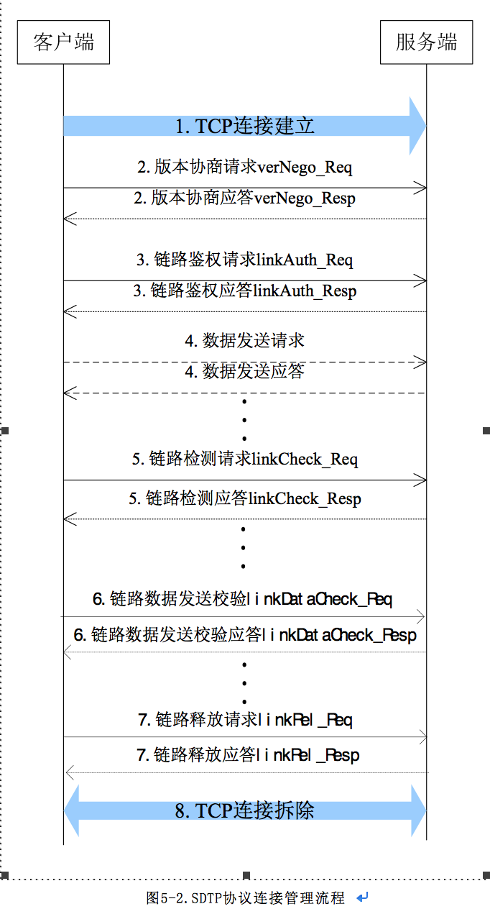

#SDTP协议说明

##SDTP消息体结构  
>  Message Header:消息头(所有消息公共包头)  
>  Message Body:消息体，即各种消息定义的参数，详见后续介绍   

##消息头（Message Header）包含如下必选字段：
字段名 字节数 类型 描述
*  TotalLength | 2 | Unsigned Integer | 消息总长度(含消息头及消息体)  
*  MessageType | 2 | Unsigned Integer | 消息类型  
*  SequenceId | 4 | Unsigned Integer | 交互的流水号，顺序累加，步长为1，循环使用（一个交互的一对请求和应答消息的流水号必须相同）  
*  TotalContents | 1 | Unsigned Integer | 消息体中的事件数量（最多40条）若考虑实时性要求，可每次只填一个事件  

##SDTP协议的消息类型定义如下表所示：
消息名 | MessageType值 | 说明  
verNego_Req | 0x0001 | 版本协商请求  
verNego_Resp | 0x8001 | 版本协商应答  
linkAuth_Req | 0x0002 | 鉴权请求  
linkAuth_Resp | 0x8002 | 鉴权响应  
linkCheck_Req | 0x0003 | 链路检测请求  
linkCheck_Resp | 0x8003 | 链路检测应答  
linkRel_Req | 0x0004 | 连接释放请求  
linkRel_Resp | 0x8004 | 连接释放应答  
linkDataCheck_Req | 0x0007 | 链路数据发送校验请求  
linkCheck_Resp | 0x8007 | 链路数据发送校验应答  
notifyXDRData_Req | 0x0005 | XDR数据通知请求  
notifyXDRData_Resp | 0x8005 | XDR数据通知应答  
XDRRawDataSend_Req | 0x0006 | XDR对应原始数据传输请求  
XDRRawDataSend_Resp | 0x8006 | XDR对应原始数据传输应答  
XDRRawDataQuery_Req | 0x0008 | XDR数据反查请求  
XDRRawDataQuery_Resp | 0x8008 | XDR数据反查应答  
notifyKpiData_Req | 0x0009 | KPI数据通知请求  
notifyKpiData_Resp | 0x8009 | KPI数据通知应答  

##  连接管理流程  
使用SDTP协议通信时，遵照本章的消息交互流程。消息交互的基本流程分为：版本协商，鉴权请求，数据传输，链路检测，连接终止。客户端侧应支持对链路检测周期的灵活设定。
SDTP协议连接管理流程如下图所示：

SDTP连接建立和通信流程说明如下：
1.	请求的发起方作为客户端向服务端指定的IP地址和端口建立TCP长连接；
2.	客户端发起版本协商流程，若协商失败，则转（7）拆除连接；
3.	客户端向服务端发起链路鉴权请求（使用数据合成服务器与各应用系统间协商好的共享密钥），若服务端鉴权失败，则转（7）拆除连接；
4.	请求的发起方发送数据，接收方收到数据并处理后回复处理结果；
5.	在连接保持期间，如果没有数据包发送，客户端发送链路检测/应答包以维持此连接；若发现链路断开，则转（7）拆除连接；
6.	通信完成后，客户端主动发起链路释放请求；
7.  双方均可拆除该连接；  

##  连接管理消息
###  版本协商verNego
####请求
版本协商请求，用于在连接的鉴权通过后，客户端与服务器端协商通信协议版本的信息，由连接的建立方主动发起协议版本协商。参数定义如下：  
字段名 | 字节数 | 类型 | 描述  
Version | 1 | Unsigned Integer | 协议的主版本号  
SubVersion | 1 | Unsigned Integer | 协议的子版本号 
版本协商的发起方从自身支持的最高版本开始协商，高版本协商失败后再协商低版本。  

####应答
版本协商应答，用于返回版本信息的核对结果，参数定义如下:  
字段名 | 字节数 | 类型 | 描述
Result | 1 | Unsigned Integer | 返回原因值。协议协商的结果，各个值代表意义如下：1: 版本协商通过。2: 版本过高。3: 版本过低。

###  链路认证linkAuth
####请求
连接鉴权请求，参数定义如下：
字段名 | 字节数 | 类型 | 描述  
LoginID | 12 | String | 账户ID。由连接的服务端给连接的客户端分配的连接帐号。  
Digest | 64 | String | 用于鉴别源用户。其值通过SHA256计算得出。当对端用相同方式加密之后与接收的值比较，如果计算出来的值相同，则通过校验，否则出错。  Digest=SHA256(LoginID+SHA256(Shared secret)+Timestamp+"rand=”+RAND) 其中Shared secret为与LoginID对应的账户密码，由认证双方实体事先商定；   
LoginID为本消息带的LoginID字段，12字节，不足12字节以空格“ ”补齐； Timestamp为本消息带的Timestamp字段数值，单位为秒（1970年1月1日0时0分0秒起至当前的偏移总秒数）；   
计算后结果为32位，后32位补零（二进制0）；具体的计算过程请参考附录E。  
Timestamp | 4 | Unsigned Integer | 时间戳的明文。由客户端产生,单位为秒（1970年1月1日0时0分0秒起至当前的偏移总秒数）  
RAND | 2 | Unsigned Integer | 由客户端产生的随机数  
####应答
连接鉴权应答，参数定义如下:  
字段名 | 字节数 | 类型 | 描述  
Result | 1 | Unsigned Integer | 鉴权的返回结果。各个值的含义如下定义：1 代表鉴权通过。2 代表LoginID不存在。3 代表SHA256加密结果出错。  
Digest | 64 | String | 用于对端对本端进行鉴权，其值通过SHA256计算得出。当对端使用相同方式加密之后与接收的值比较，如果计算出来的值相同，则通过校验，否则出错。  

###   检测linkCheck
####请求
当信道上没有数据传输时，客户端应每隔时间C发送链路检测包以维持此连接，当链路检测包发出超过时间T后未收到响应，应立即再发送链路检测包。服务端收到链路检测请求包后，立即回复链路检测应答。
无参数。
####应答
链路检测请求的应答，无参数。

###   链路数据发送校验linkDataCheck
####请求
本消息与notifyXDRData_Req和XDRRawDataSend_Req消息同方向。消息的作用是，告知数据接收方，在两个本消息间隔期内发送的notifyXDRData_Req和XDRRawDataSend_Req消息包数量，以便接收方校验是否有丢包情况发生。若有丢包发生时，notifyXDRData_Req和XDRRawDataSend_Req消息的接收方应立即通过返回消息告知发送方有数据丢失。本消息建议5分钟进行数据校验，数据量大时为避免过多的传输缓存，可减少时间间隔，数据接收方应不受校验周期影响。  
字段名 | 字节数 | 类型 | 描述  
Sendflag | 4 | Int | 检测包顺序标签，1小时内不重复即可。本参数目的是为发现校验包的丢失情况发生。
SendDataInfo | 4 | int | 距离上次发送间发送的数据包数量。（仅仅包含notifyXDRData_Req和XDRRawDataSend_Req包的数量）
####应答
本消息与notifyXDRData_Req和XDRRawDataSend_Req消息方向相反。消息的作用是，告知数据发送方，在两个本消息间隔期内接收了多少个notifyXDRData_Req和XDRRawDataSend_Req消息包，以便告知发送方是否有丢包情况发生。   
字段名 | 字节数 | 类型 | 描述 
Sendflag | 4 | Int | 检测包顺序标签，1小时内不重复即可。（与请求包相同）
result | 1 | int | 0：数据量正确；1：接收方数据小于发送方数据；2：接收方；数据大于发送方数据。
SendDataInfo | 4 | int | 距离上次发送间发送的数据包数量。（仅仅包含notifyXDRData_Req和XDRRawDataSend_Req包的数量）（与请求包相同）
RecDataInfo | 4 | int | 距离上次发送间接收的数据包数量。（仅仅包含notifyXDRData_Req和XDRRawDataSend_Req包的数量）

###  链路释放linkRel
####请求
连接释放请求，指示连接的某一方由于某些原因而需要断开连接，参数定义如下：  
字段名 | 字节数 | 类型 | 描述  
Reason | 1 | Unsigned Integer | 连接释放的原因，各个值代表意义如下：1: 用户正常释放。2: 数据类型错误。3: 超出机器处理能力。  
####应答
连接释放完成应答，收到本消息之后或者请求超时后，释放本连接的所有资源，参数定义如下：  
字段名 | 字节数 | 类型 | 描述  
Result | 1 | Unsigned Integer | 连接释放的完成状态1：释放完成。其它：释放失败。

